### Langkah-langkah Install Git

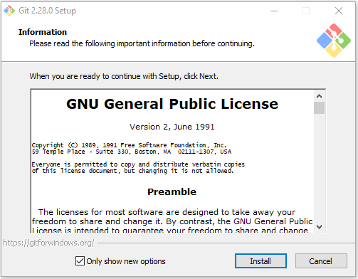
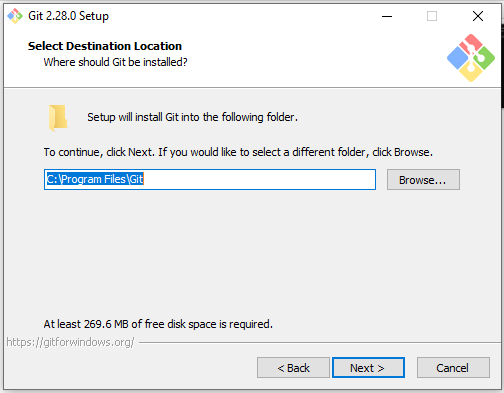
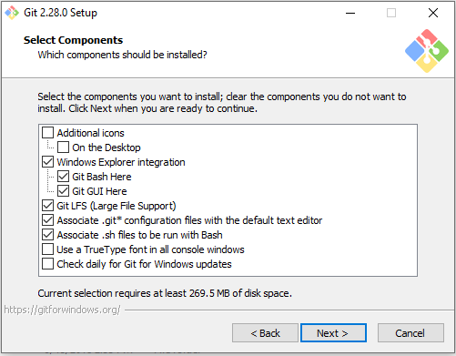
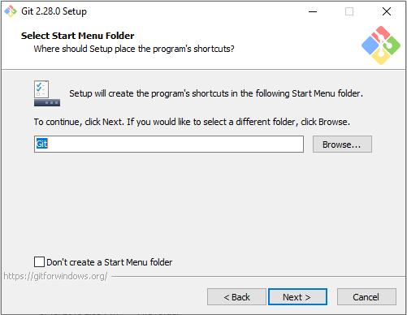
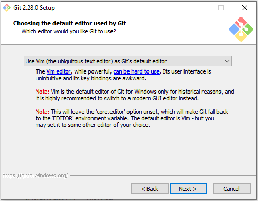
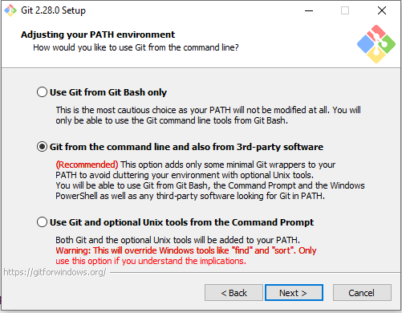
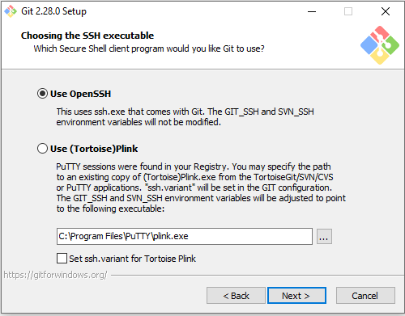
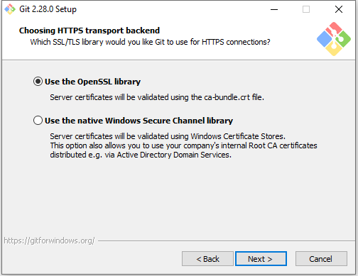
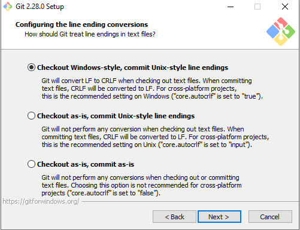
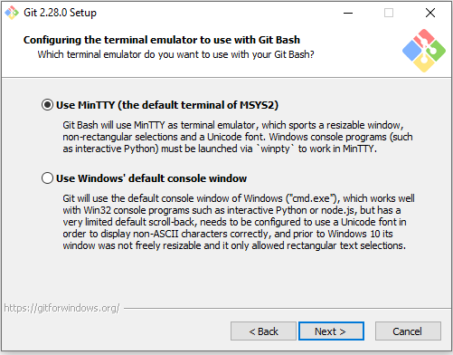
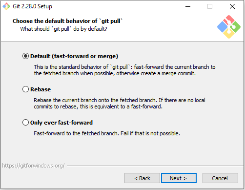
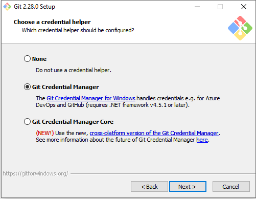
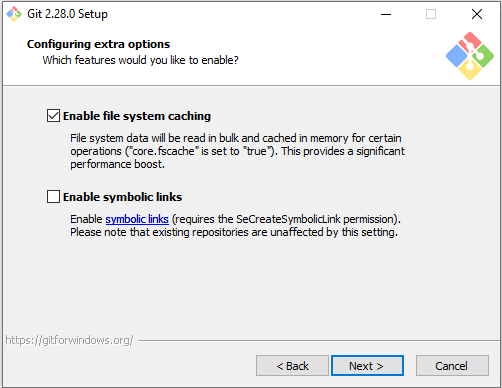
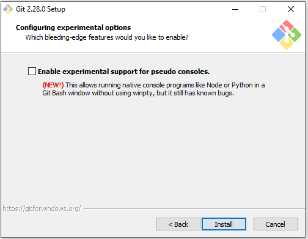
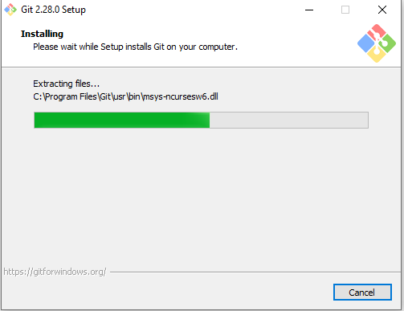
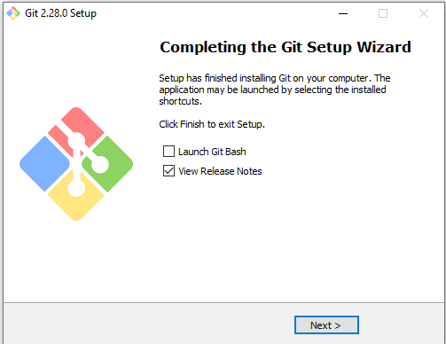

### Membuat Repository 

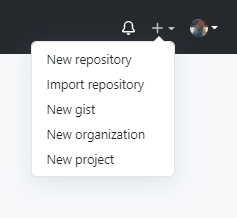
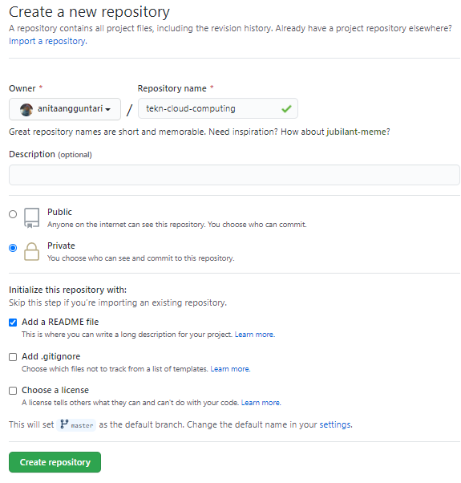

### Configurasi dengan GIT Console

1. Cek Versi Git
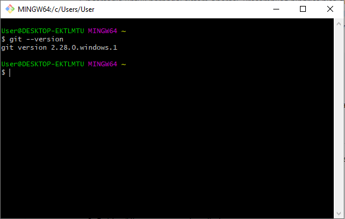
2. Konfiguarasi username dan email pada github
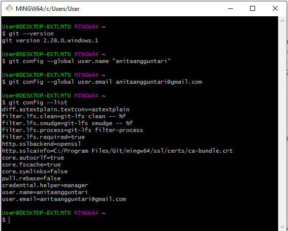
3. Clone repository
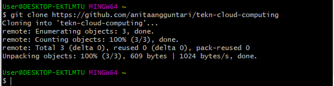
