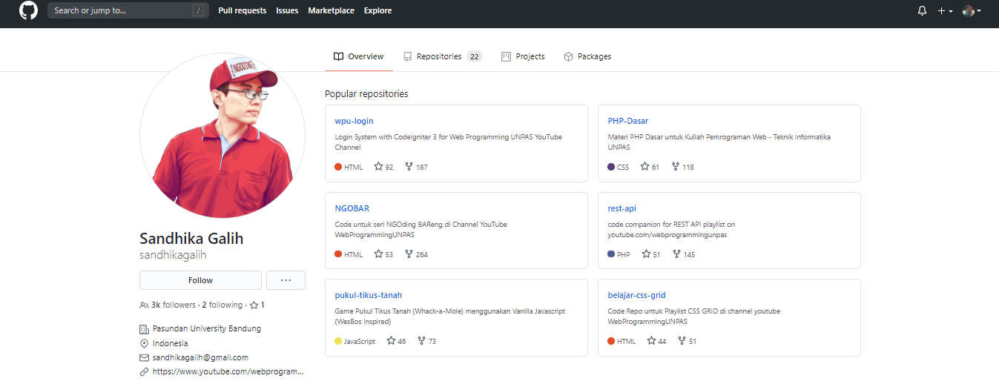
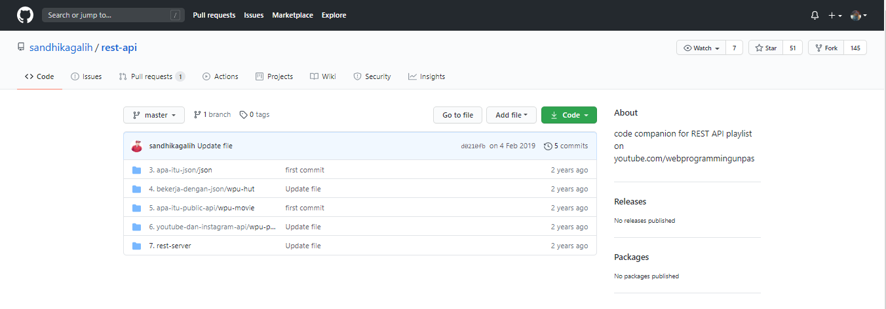
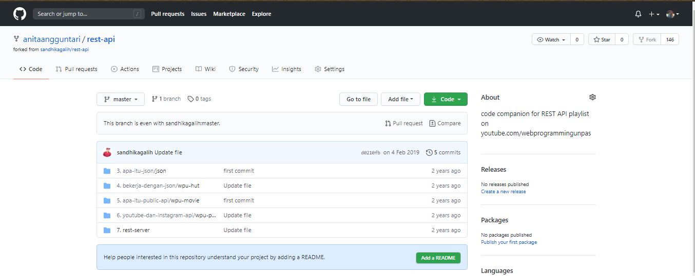
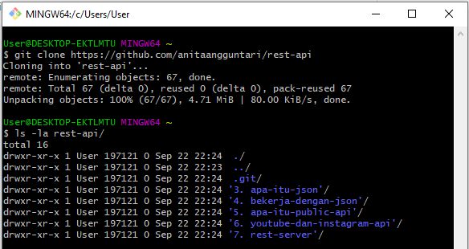
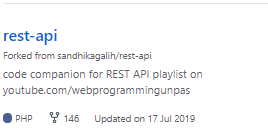

## Fork https://github.com/sandhikagalih/rest-api

1. pilih akun yang akan di fork

2. pilih repo yang akan di fork

3. klik tombol fork

4. clone repo ke komputer

5. repo hasil fork di github kita

